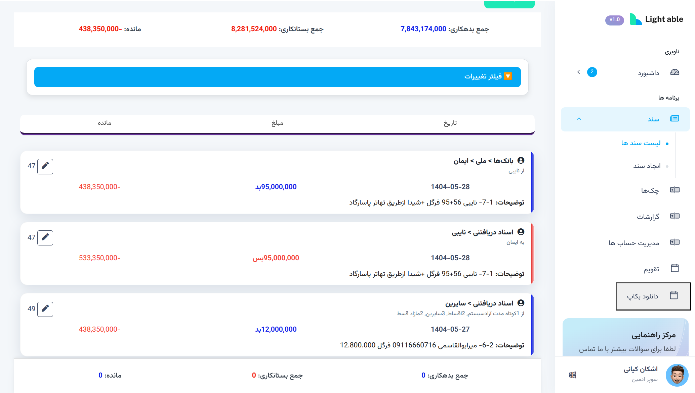
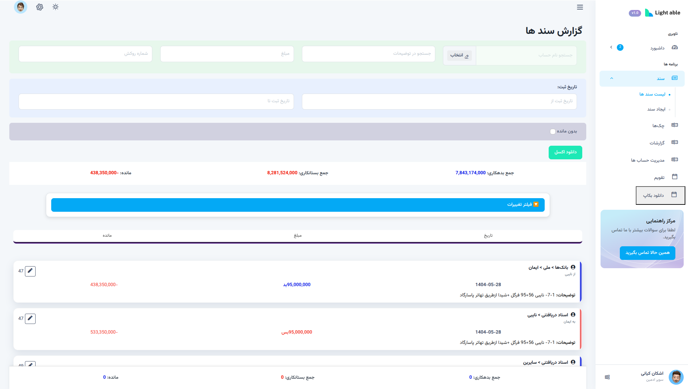
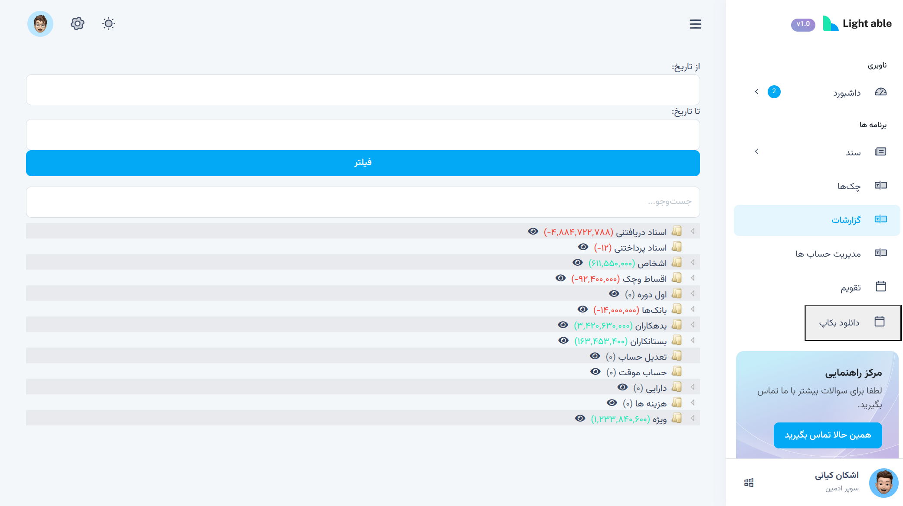
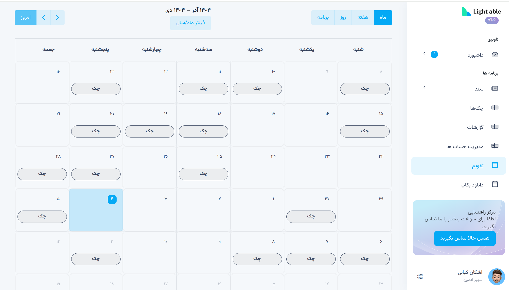

# Accounting System with Django

A practical **Accounting Management System** built with Django, focused on real-world financial workflows, dynamic document creation, and hierarchical chart of accounts.

This project is developed as a **portfolio-grade backend application** to demonstrate mid-level Django skills in designing business-oriented systems.

---

## 📖 Project Overview

This system helps manage core accounting operations such as:

- Creating accounting documents
- Managing balance sheets and financial entries
- Organizing accounts in a hierarchical structure
- Handling dynamic forms without full page reloads

The main goal of this project is to model **real accounting logic**, not just CRUD operations.

---

## ✨ Key Features

- **Accounting Document Management**
  - Creation and management of accounting documents
  - Support for multiple financial entries per document

- **Dynamic Nested Forms (AJAX)**
  - Add and remove form rows dynamically
  - No page reloads during data entry
  - JSON-based responses for frontend interactions

- **Hierarchical Chart of Accounts**
  - Tree-based account structure using `django-mptt`
  - Suitable for real accounting classifications

- **Cheque Due Date Calendar (Initial Implementation)**
  - Basic calendar view for tracking cheque due dates
  - Designed as a foundation for future reminders and status tracking

- **Modular Django Architecture**
  - Separated apps for better maintainability
  - Clear domain boundaries (users, accounting, finance)

- **Permission-Aware Design**
  - Access control based on user roles
  - Extendable for more granular permissions

- **Scalable Codebase**
  - Ready to be refactored into Service Layer or REST APIs (DRF)
  - Designed with future extensibility in mind

---

## 🧱 Tech Stack

- **Backend:** Python, Django  
- **Database:** PostgreSQL / SQLite  
- **Frontend Logic:** JavaScript, AJAX (jQuery)  
- **Tree Structure:** django-mptt  
- **Auth:** Django Authentication System

---


Business logic is currently handled inside views and forms for faster delivery.  
The structure is intentionally kept **clean and refactor-ready** for service-oriented or API-based architectures.

---


🖼 Screenshots / Demo

cheque list with live filter


Hierarchical chart of accounts (tree view)

Cheque due date calendar (initial version)



## ▶️ How to Run Locally

```bash
git clone https://github.com/shayantr/hesabdari-with-django.git
cd hesabdari-with-django

python -m venv venv
source venv/bin/activate  # On Windows: venv\Scripts\activate

pip install -r requirements.txt
python manage.py migrate
python manage.py createsuperuser
python manage.py runserver
